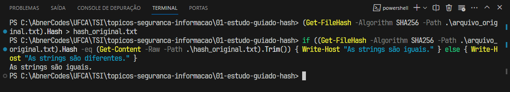
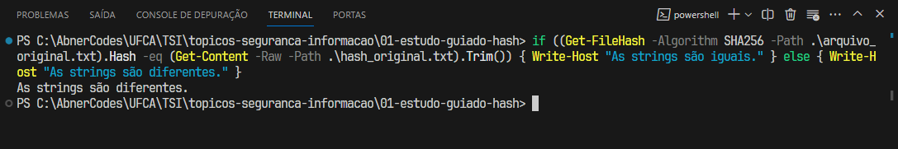

# Parte 1 - Hash no terminal

[_Voltar para página incial_](/README.md)

Neste estudo dirigido vamos utilizar algoritmos hash para verificar a integridade de arquivos. Nesta atividade prática, aprenderemos a gerar e verificar _hashes_ usando os terminais _Linux_ e _PowerShell_.

---

### Conteúdo original:

- Comando para gerar um _hash_ usando o algoritmo `SHA256`:

```
(Get-FileHash -Algorithm SHA256 -Path .\arquivo_original.txt).Hash > hash_original.txt
```

Onde:

- `arquivo_original.txt` - É o arquivo a ser verificado a sua integridade;
- `hash_original.txt` - É o arquivo que armazena o cálculo do _hash_ para posterior verificação.

---

### Verificação de Integridade

- Comando para verificar a integridade do arquivo (`arquivo_original.txt`) em relação ao _hash_ gerado (`hash_original.txt`):

```
if ((Get-FileHash -Algorithm SHA256 -Path .\arquivo_original.txt).Hash -eq (Get-Content -Raw -Path .\hash_original.txt).Trim()) { Write-Host "As strings são iguais." } else { Write-Host "As strings são diferentes." }
```



---

### Simulação de Alteração e Verificação

A partir deste novo tópico o arquivo `arquivo_original.txt` foi modificado. Dessa forma, executando o código acima novamente teremos uma resposta diferente:

