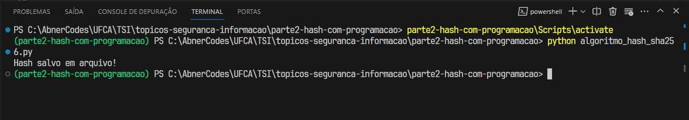
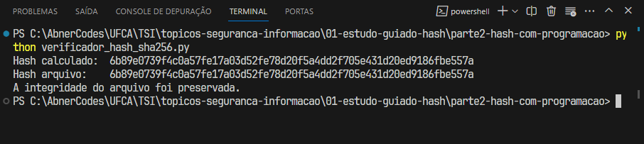
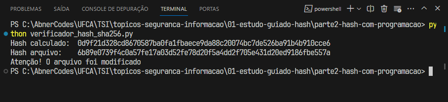
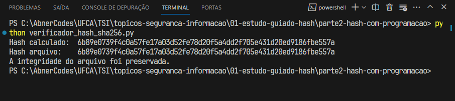
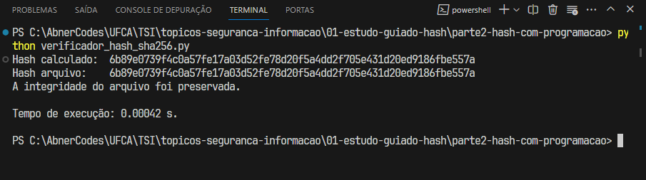
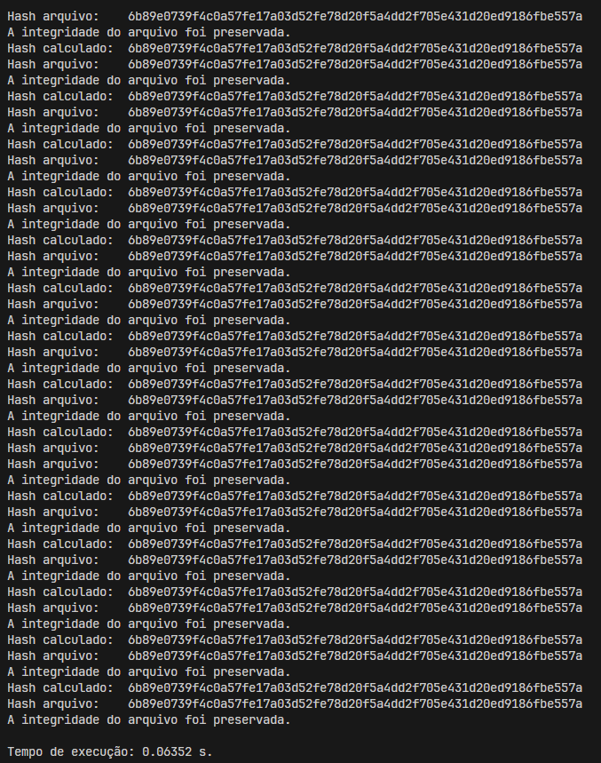
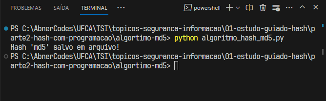
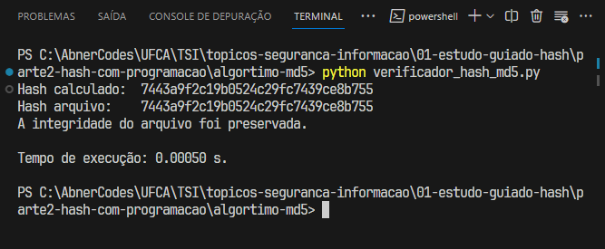

# Parte 2 - Hash com programação

[_Voltar para página incial_](/README.md)

Nesta segunda parte, foi construído um script Python e, executado diferentes partes dele e observado como a integridade do arquivo era afetada.

---

## Algoritmo Hash SHA-256:

- Explicação do código `algoritmo_hash_sha256.py`:

  - A função `calcular_hash` utiliza o algoritmo `SHA-256` para calcular o _hash_ do arquivo em blocos de `4096 bytes`.
  - A função `salvar_hash` salva o _hash_ calculado em um arquivo texto para referência futura.
  - A função `verificar_integridade` compara o _hash_ atual do arquivo com o _hash_ salvo, indicando se a integridade foi mantida.

---

### Uso:

Para usar a solução, se certifique que o arquivo a ser encriptografado `"exemplo.txt"` esteja na pasta raiz (`\parte2-hash-com-programacao\algortimo-sha256`), então execute:

- Terminal:

  ```
  python algoritmo_hash_sha256.py
  ```

---

### Resultado | Passo 3: Execução e Observação



---

### Resultado | Passo 4: Alteração de código

_Foi indicado no estudo guiado para modificarmos o código `algoritmo_hash_sha256.py`. no entanto, optei por criar um novo código chamado `verificador_hash_sha256.py`._

- **O que está sendo feito no código?**

  O novo código por meio de uma codicional verifica utilizando a função `verificar_integridade()` e, calcula usando a função `calcular_hash()` se o _hash_ criado ainda permanece o mesmo, ou em outras palavras se o arquivo de texto ainda é o original

- **O que você interpreta do resultado?**

  O código retornou que o arquivo ainda permanecia intacto.



---

### Resultado | Passo 5: Alteração do arquivo

Foi realizada a alteração do conteúdo do arquivo original manualmente, adicionando algumas novas informações e o código foi executado novamente.



---

### Resultado | Passo 6: Restauração do arquivo

Foi realizada a restauração do conteúdo original e executado o script mais uma vez.



---

### Resultado | Passo 7: Medindo o tempo de execução

- Valor do parâmetro `number`:

  - Para `1` obteve-se um tempo de execução de `0.00042 s`:

    

  - Para `100` obteve-se um tempo de execução de `0.06352 s`:

    

## Questões para exercitar

### Questão 1. Experimentem alterar o algoritmo _hash_ para `MD5` ou `SHA-1` e observem como isso afeta os resultados de tempo.

- Modificamos o código `algoritmo_hash_sha256.py` e o `verificador_hash_sha256.py` e, criamos novos códigos chamados `algoritmo_hash_md5.py` e `verificador_hash_md5.py`:

  - Para geração do hash usando `MD5` executamos o script `algoritmo_hash_md5.py` e como resltado temos:

    

  - Já executando a verificação de integridade e analisando o tempo temos:

    - Parâmetro `number = 1`:

    

---

### Questão 2. Como o script detectou as modificações?

O código calcula o hash do arquivo atual usando a função `calcular_hash()`, e faz uma comparação se o _hash_ já criado ainda permanece o mesmo, ou em outras palavras se o arquivo de texto ainda é o original.

---

### Questão 3. Qual é a importância prática disso em situações do mundo real?

Através destas técnicas podemos verificar se um arquivo foi modificado ou não, isto é, se ele foi violado ou não, se ele possui alguma carga de código nociva além do esperado, bem como muitas ouras aplicações.

Podemos pensar por um outro ponto de vista, na questão de controle de versionamento, onde é possível verificar quantas versões há de um mesmo arquivo, quem modificou e onde foi modificado.
