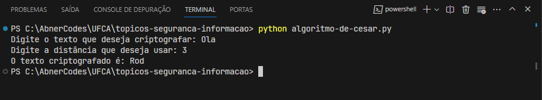

# Algoritmo de César

[_Voltar para página incial_](/README.md)

O algoritmo de César consiste em substituir cada letra do texto por outra letra que está a uma certa distância no alfabeto. Por exemplo, se a distância for 3, a letra A será substituída por D, a letra B por E, e assim por diante. A distância é a chave secreta que só quem quer ler o texto deve saber. Para descriptografar, basta fazer o processo inverso, ou seja, subtrair a distância de cada letra.

## Uso

Para usar a solução, execute o código:

- Terminal:

  > `python algoritmo-de-cesar.py`

Depois digite um `texto` e uma `distância`.

## Exemplo de Teste

Por exemplo, se digitar `Ola` e `3`, o resultado será `Rog`. Para descriptografar, basta usar a mesma distância, mas com o sinal negativo. Por exemplo, se digitar `Rog` e `-3`, o resultado será `Ola`.