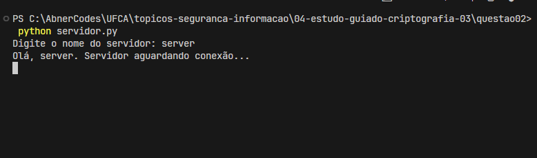
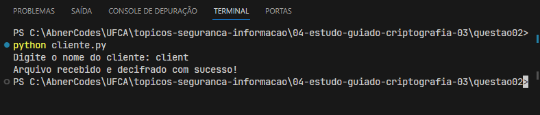
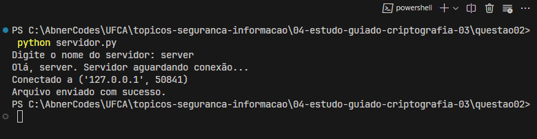

## Questão 2

[_Voltar para página incial_](/README.md)

Agora use uma lógica parecida não para transferir a chave, mas para transferir o arquivo. Um código deve criptografar o arquivo e abrir um socket. O outro código deve ler o arquivo pelo socket e decifrar o arquivo.

---

- Criamos dois arquivos:
  - Arquivo servidor responsável por enviar um arquivo/texto encriptado: `servidor.py`;
  - Arquivo servidor responsável por receber um arquivo/texto encriptado e descriptar: `cliente.py`;

Para usar a solução, se certifique que o arquivo a ser encriptografado "arquivo.txt" esteja na pasta raiz (`\topicos-seguranca-informacao\04-estudo-guiado-criptografia-03\questao_02`), então execute:

- Primeiro terminal:

  > `python servidor.py`

  

- Segundo terminal:

  > `python cliente.py`

  

- Resposta servidor:

  
