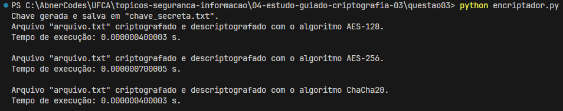

## Questão 3

Use algoritmos com tamanhos de chave diferentes. Você deve informar o algoritmo e os parâmetros na variável cipher_suite. Pesquise como fazer isso na documentação da biblioteca Cipher. O tempo de processamento aumenta ou diminui?

---

- Criamos somente um arquivo:
  - Arquivo servidor responsável por encriptar e desencriptar um arquivo: `encriptador.py`;

Neste arquivo optamos por utilizar um objeto (dicionário) contendo o algoritmo e o tamanho da chave conforme é mostrado abaixo:

```JSON
algoritmos_chaves = {
    "AES-128": 16,
    "AES-256": 32,
    "ChaCha20": 32
}
```

Dessa forma, através de um loop percorremos este objeto de forma a usar cada um desse algoritmos para encriptar e desencriptar.

---

Para usar a solução, se certifique que o arquivo a ser encriptografado `"arquivo.txt"` esteja na pasta raiz (`\topicos-seguranca-informacao\04-estudo-guiado-criptografia-03\questao_03`), então execute:

- Terminal:

  > `python encriptador.py`

### Resultado



Conforme é possível verificar pela figura acima, com um arquivo muito pequeno (27 bytes)
ainda há uma diferença entre os tempos:

`AES-256 > AES128 = ChaCha20`
