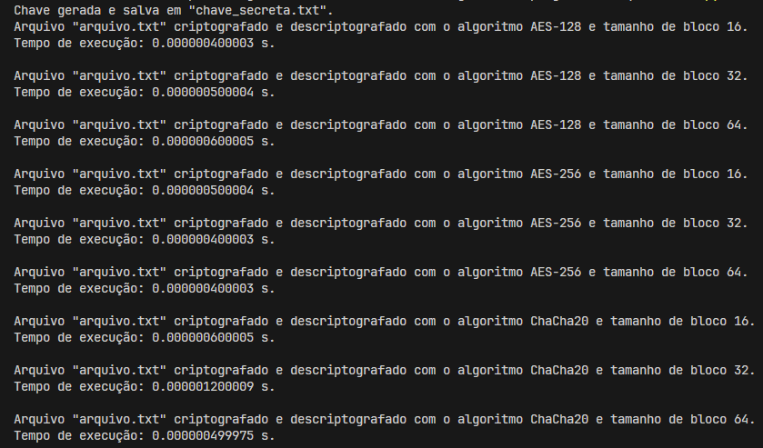

## Questão 4

[_Voltar para página incial_](/README.md)

Pesquise como alterar o tamanho do bloco de criptografia do algoritmo. Pesquise como fazer isso na documentação da biblioteca <a href="https://pycryptodome.readthedocs.io/en/latest/src/examples.html">Cipher</a>. Realize experimentos alterando o tamanho do bloco e observe: o tempo de criptografia aumentou ou diminuiu?

---

- Criamos somente um arquivo:
  - Arquivo servidor responsável por encriptar e desencriptar um arquivo: `encriptador.py`;

Com base na documentação indicada vimos que:

- A biblioteca Crypto é mais antiga e oferece uma interface mais simples.
- A biblioteca <a href="https://cryptography.io/en/latest/hazmat/primitives/symmetric-encryption/">cryptography.hazmat.primitives.ciphers</a> é mais recente e oferece mais opções e flexibilidade, dessa forma, optamos por utilizá-la.

Neste arquivo optamos por utilizar um objeto (dicionário) contendo o algoritmo e o tamanho da chave conforme é mostrado abaixo:

```JSON
algoritmos_chaves = {
    "AES-128": 16,
    "AES-256": 32,
    "ChaCha20": 32
}
```

Dessa forma, através de um loop percorremos este objeto de forma a usar cada um desse algoritmos para encriptar e desencriptar.

---

Para usar a solução, se certifique que o arquivo a ser encriptografado `"arquivo.txt"` esteja na pasta raiz (`\topicos-seguranca-informacao\04-estudo-guiado-criptografia-03\questao_03`), então execute:

- Terminal:

  > `python encriptador.py`

### Resultado



Conforme é possível verificar pela figura acima, apesar de ser um arquivo muito pequeno (27 bytes)
ainda há uma diferença entre os tempos:

---

- Para blocos de 16 bytes:
  - `AES-128 = 0.000000400003 s`
  - `AES-256 = 0.000000500004 s`
  - `ChaCha20 = 0.000000600005 s`

Portanto, `ChaCha20 > AES-256 > AES-128`

---

- Para blocos de 32 bytes:
  - `AES-128 = 0.000000500004 s`
  - `AES-256 = 0.000000400003 s`
  - `ChaCha20 = 0.000001200009 s`

Portanto, `ChaCha20 > AES-128 > AES-256`

---

- Para blocos de 64 bytes:
  - `AES-128 = 0.000000600005 s`
  - `AES-256 = 0.000000400003 s`
  - `ChaCha20 = 0.000000499975 s`

Portanto, `AES-128 > ChaCha20 > AES-256`
