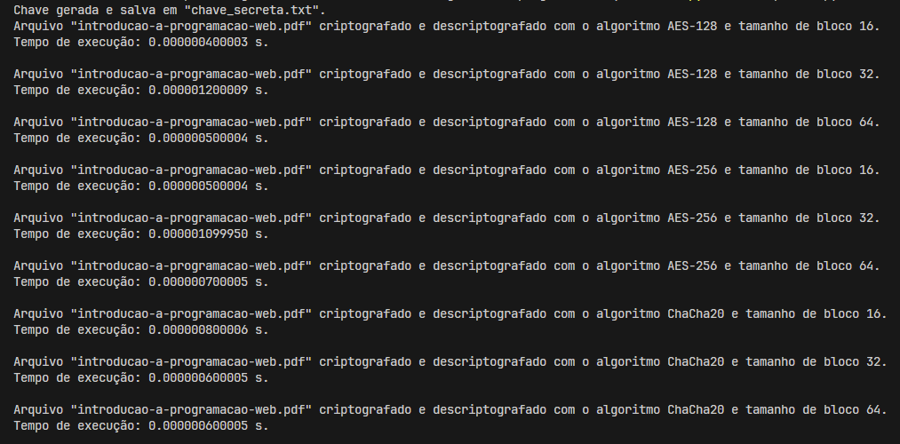

## Questão 4

[_Voltar para página incial_](/README.md)

Refaça os exercícios anteriores com arquivos grandes, de muitos MB ou até mesmo GB. Observe o tempo de criptografia

## Solução

Para usar a solução, se certifique que o arquivo a ser encriptografado `"introducao-a-programacao-web.pdf"` esteja na pasta raiz (`\topicos-seguranca-informacao\04-estudo-guiado-criptografia-03\questao_05`), então execute:

- Terminal:

  > `python encriptador.py`

### Resultado

Conforme é possível verificar pela figura acima, o arquivo a ser encriptado é um `".pdf"` com tamanho de `1,82 MB` (`1.917.053 bytes`) utilizamos a solução de encriptação por blocos.

---

- Para blocos de 16 bytes:
  - `AES-128 = 0.000000400003 s`
  - `AES-256 = 0.000000500004 s`
  - `ChaCha20 = 0.000000800006 s`

Portanto, `ChaCha20 > AES-256 > AES-128`

---

- Para blocos de 32 bytes:
  - `AES-128 = 0.000001200009 s`
  - `AES-256 = 0.000001099950 s`
  - `ChaCha20 = 0.000000600005 s`

Portanto, `AES-128 > AES-256 > ChaCha20 `

---

- Para blocos de 64 bytes:
  - `AES-128 = 0.000000500004 s`
  - `AES-256 = 0.000000700005 s`
  - `ChaCha20 = 0.000000600005 s`

Portanto, `AES-256 > ChaCha20 > AES-128`
